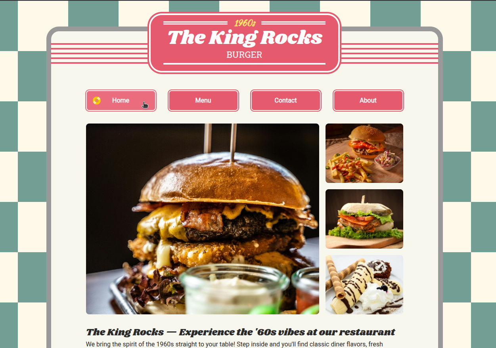
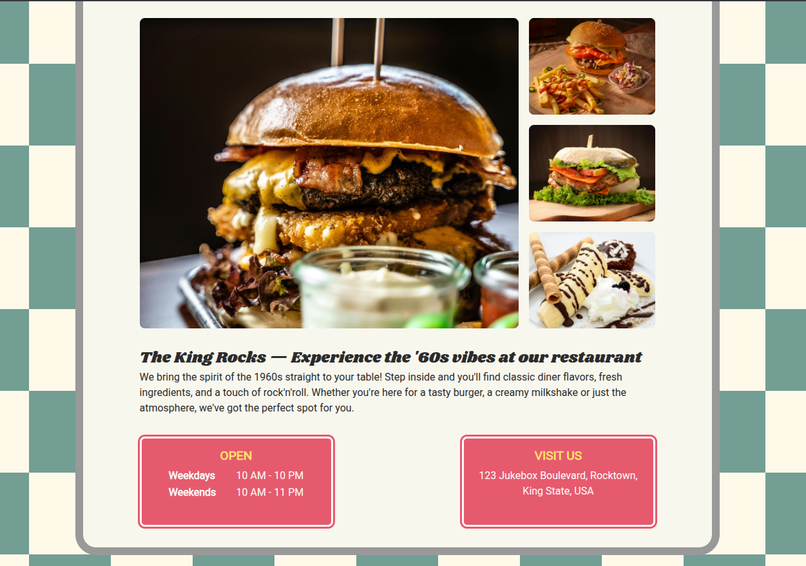
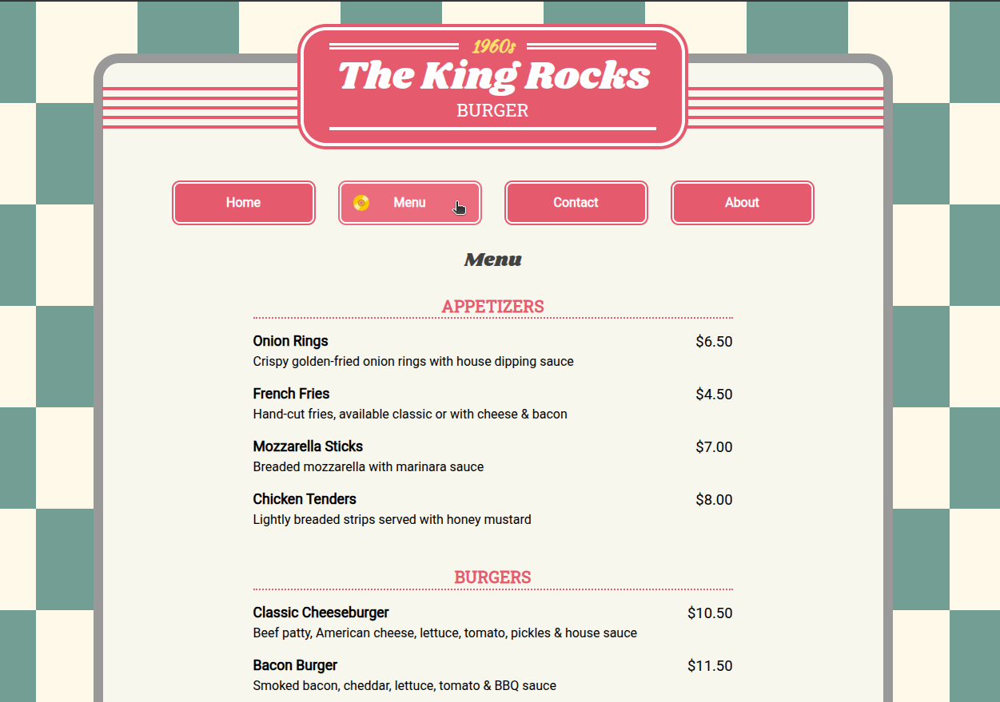

# Restaurant Page

## Description

- It's a web page for a fictional restaurant called "The King Rocks", inspired by the 1960s. It includes the following pages: Home, Menu, Contact and About.
- **Features:**
    - Webpack module bundler
    - JavaScript's ES6 modules
    - DOM elements creation using JavaScript

## Live Demo

**[Click here](https://pedroasb.github.io/restaurant-page/)** to try out this project on browser.

## Screenshots

## About the Project

This project is part of the curriculum of [The Odin Project](https://www.theodinproject.com/). You can check out other projects that I've built in my [fullstack-journey](https://github.com/PedroASB/fullstack-journey) repository.

**Interesting fact:** this fictional restaurant "The King Rocks" is a tribute to a real restaurant from my hometown in Brazil. It was called "King's Rock" and sadly closed its doors around late 2013.

## Attributions

- **Icons**
    - CD icons created by [Freepik - Flaticon](https://www.flaticon.com/free-icons/cd)
- **Images**
    - Checkerboard background image by [freepik](https://www.freepik.com/free-vector/flat-design-chess-background_151822019.htm#fromView=keyword&page=1&position=0&uuid=230b6d66-1b33-4d9e-9ce8-4fb8b9ea745f&query=Checkered+background)
    - Hamburger Photo 1 by [David Geib](https://www.pexels.com/photo/close-up-photo-of-burger-3220617/)
    - Hamburger Photo 2 by [Rajesh TP](https://www.pexels.com/photo/tomato-burger-and-fried-fries-1600727/)
    - Sandwich Photo by [Rajesh TP](https://www.pexels.com/photo/cheese-burger-on-brown-chopping-board-1624473/)
    - Dessert Photo by [Pixabay](https://www.pexels.com/photo/brown-cake-on-white-ceramic-plate-47062/)
- **Fonts**
    - Shrikhand, Roboto, Roboto Slab, Kaushan Script — all available on [Google Fonts](https://fonts.google.com/) under the Open Font License
